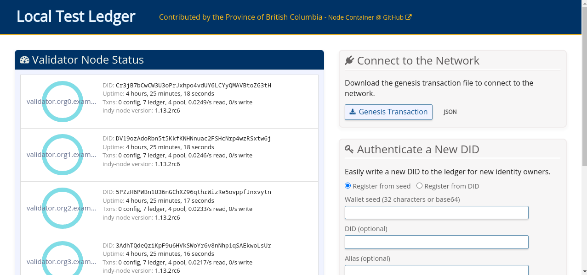

# MinIndy: Ferramenta Automatizada para Construção de Redes Blockchain Hyperledger Indy

A plataforma Hyperledger Indy, focada em redes de gestão de identidade baseadas em blockchain, vem ganhando destaque, porém a implementação de uma rede completa em ambiente de produção é desafiadora e requer habilidades especializadas. Com o intuito de simplificar esse processo, este artigo apresenta o MinIndy, uma ferramenta desenvolvido para automatizar a instalação, configuração e administração de redes Indy. Portanto, o MinIndy surge como uma solução viável para indivíduos e organizações que desejam adotar redes blockchain Indy com menos intervenção manual e maior eficiência.

## Pré-requisitos

* [Docker](https://www.docker.com/) versão >= 18.03.

## Instalação

> [!IMPORTANT]
> Você precisará de pelo menos 4 GB de RAM e 5 GB de armazenamento em disco restantes disponíveis para executar o MinIndy na máquina local.

No Linux (Ubuntu, Fedora, CentOS): 
```
mkdir -p ~/mywork && cd ~/mywork && curl -o minindy -sL https://raw.githubusercontent.com/gercom-ufpa/minindy/main/minindy && chmod +x minindy
```

> [!TIP]
> Para disponibilizar o minindy em todo o sistema: `sudo mv minindy /usr/local/bin`

## Começando

Este tutorial instaciará uma rede Hyperledger Indy mínima para funcionamento em 3 Trustees, 4 Stewards e 4 Validators (1 para cada Stewards). 

> [!CAUTION]
> Usaremos de chave criptográficas padrão para os Trustees e Stewards, mas é obriatório que cada Trustees e Stewards gerem suas próprias chaves e as mantem seguras.

```
minindy init -e 1079
```

Faça um cópia e preencha a [planilha](https://docs.google.com/spreadsheets/d/1K7y4GAIWTqpMy-4VnXnpwfwruPuI0d5gh_fiBZj__tE/edit?usp=sharing) com o **endereço IP** do computador todas as linhas das colunas **Node IP address** e **Client IP address**. Com o resutado do comando anterior, para as linhas dos respectivos validadores, preencha as linhas as colunas **Validator verkey**, **Validator BLS key** e **Validator BLS POP** com as informações **Verification key**, **BLS Public key** e **Proof of possession for BLS key**.

```
cd ~ && git clone https://github.com/bcgov/von-network.git && cd von-network/ && ./manage build
```

Salve no diretório `~/von-network/tmp` as abas **trustees** e **stewards** da planilha anteior em CSV com os seguintes nomes **trustees.csv** e **stewards.csv**, respectivamente.

```
./manage generategenesisfiles trustees.csv stewards.csv && mv tmp/*_genesis ~/mywork/vars/ && cd ~/mywork && minindy start
```

A rede já está em funcionamento e pode ser conferida utilizando o comando `docker ps`. Também é possível usar uma interface web para visualizar a rede em funcionamento, basta executar os seguintes comandos.

```
cd ~
git clone https://github.com/hyperledger/indy-node-container.git && cd indy-node-container/test/ && mkdir -p lib_indy/sandbox
cp ~/mywork/vars/*_genesis lib_indy/sandbox/
INDY_NETWORK_NAME=sandbox docker compose up webserver
```

A interface web estará diponível em [http://localhost:9000/](http://localhost:9000/). A interface web será similar a abaixo.


